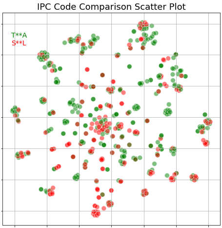

# A Hitchhiker's Guide to Indian Patent Analytics

The files in this repository are intended to be read along with the article of the same title published on LinkedIn.

The Jupyter notebook featured in this repository shows how Indian Patent Office data downloaded from a free [PATENTSCOPE](http://patentscope.wipo.int) account can be used for patent analytics projects. The capabilities of such amateur efforts are obviously limited, but as the results here show, it is possible to perform moderately sophisticated search and comparison efforts. Such exercises are also very effective as learning and training aids.

In the example presented here we compare the [IPC codes](https://en.wikipedia.org/wiki/International_Patent_Classification) in patent applications filed by two steel-making companies in the last 5 years. The results of the analysis are presented in the form of the scatter plot shown below.

Each colored point on this scatter plot depicts an IPC code from a patent application of one company (identified by color). Points on such [t-SNE](https://en.wikipedia.org/wiki/T-distributed_stochastic_neighbor_embedding) mapping diagrams are located so that \"... *similar objects are modeled by nearby points and dissimilar objects are modeled by distant points* ...\" (quoted from [Wikipedia](https://en.wikipedia.org/wiki/T-distributed_stochastic_neighbor_embedding)). Any cluster of points all of the same color therefore could possibly be a strong group of related patents -- a matter of some concern to the other company. Such maps are useful for the identification of strong patent groups, white-spaces and [thickets](https://en.wikipedia.org/wiki/Patent_thicket) in the evaluation of competitive strengths.

The input data used for this notebook (the Excel file named *resultList2.xls*) was downloaded from PATENTSCOPE earlier and then cleaned using a process described in the LinkedIn article."
